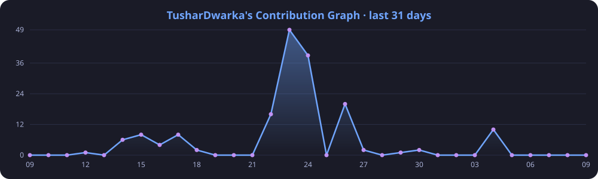

# Hi, I'm Tushar 👋

**Data Science student** who likes turning messy data into answers — and occasionally shipping the app around it.

- 📊 Studying Data Science: statistics, machine learning, data analysis
- 🔬 Working with Python, pandas, NumPy, SciPy and PyTorch
- ☀️ Recent: **[ROI-solar-photovoltaic](https://github.com/TusharDwarka/ROI-solar-photovoltaic)**, an ROI analysis of solar PV
- 🛠️ Side projects: web tools, mobile apps and a card game in C
- 💬 Ask me about Python, data wrangling or ML

 

###  Now Playing

### 🚀 Featured Projects

## 💻 Tech Stack

**Data Science & ML**

**Other Languages & Cloud**

**Tools & Design**

## 📊 GitHub Stats

